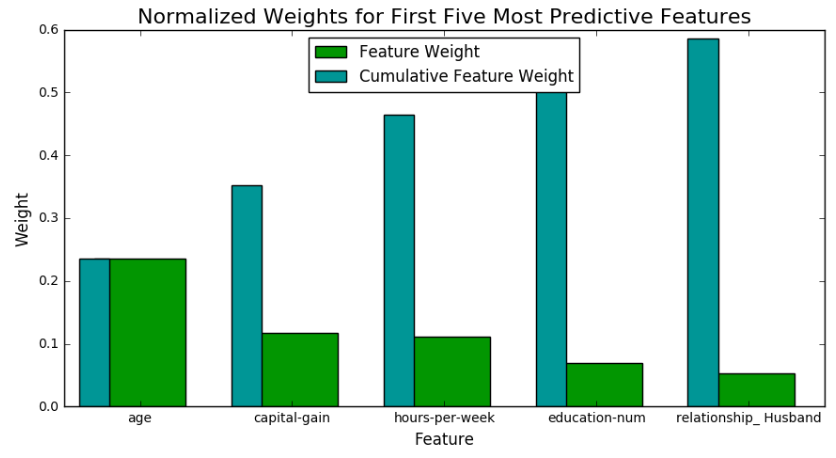

# Finding Donors for CharityML

## Summary

In this project, we are trying to help a charity classify potential donors that have an income of more than $50K. We first preprocess the data by normalizing numerical features and one-hot encoding categorical features. Then, we compare the F-beta score across multiple classification algorithms. From those results, we further tune two models using grid search to improve the accuracy and F-beta score. Finally, we explore the features importances from the random forest and AdaBoost models.

## Data

The census.csv dataset for this project originates from the UCI Machine Learning Repository. The data we investigate here consists of small changes to the original dataset, such as removing the 'fnlwgt' feature and records with missing or ill-formatted entries. The 13 features relate to things like education, occupation, and relationships.

## Comparing Logistic Regression, Support Vector Machines, and Random Forests

Logistic regression slightly outperformed the random forest (rf) and SVC models in terms of a higher fbeta score on the test set. Both the random forest model and logistic regression model trained very quickly relative to the much slower SVC model. That said, the default parameters for the random forest with no max depth specified will create a model that severly overfits to the training data (as seen in the much higher scores on the training data relative to the test data). As a result, the rf model learned is not very good and performs poorly on the test data. Therefore, I'm inclined to tune both the rf and logistic regression models, dropping the SVC model due to its slow training time and similar fbeta scores to the other models.

## Using Grid Search to Improve Model Results

Using Grid Search, the random forest classifier improved in accuracy and f-score after tuning the number of estimators, max_depth, and minimum number of samples for splits and leaves. Accuracy on the test set increased by 2 percentage points to 86% and f-score improved by 0.06 to 0.73.

## Feature Importances from Random Forest and AdaBoost Models

**Random Forest Feature Importances**

**AdaBoost Feature Importances**

From my initial predictions on feature importance, I only correctly identified three of the key features (capital gains, education level, and age), but was far off in the ordering. I had age as my fifth most important variable, whereas the models picked it as the first or second most important. I also didn't identify hours per week, relationship, or capital loss as key features. Hours per week makes sense looking back because we would expect that higher number of hours worked would correlate with a higher income. It's unfortunate that relationship - husband was one of the top predictors, but I can understand how when one partner works this could be the case.

Interestingly, the random forest and adaptive boosting algorithms identified similar, but not identical variables and importances. Both models found age and capital gain to be highly important, but only the adaptive boosting model identified capital loss as a feature and its most important feature at that.
